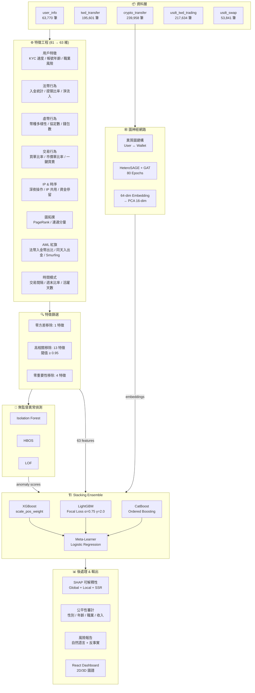
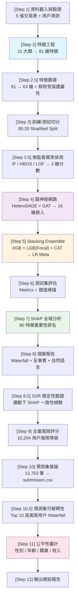
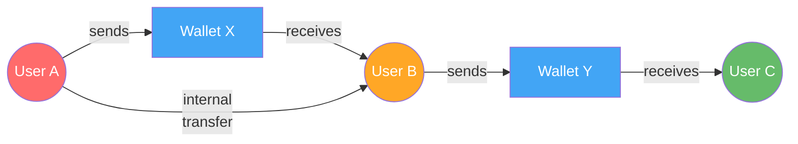
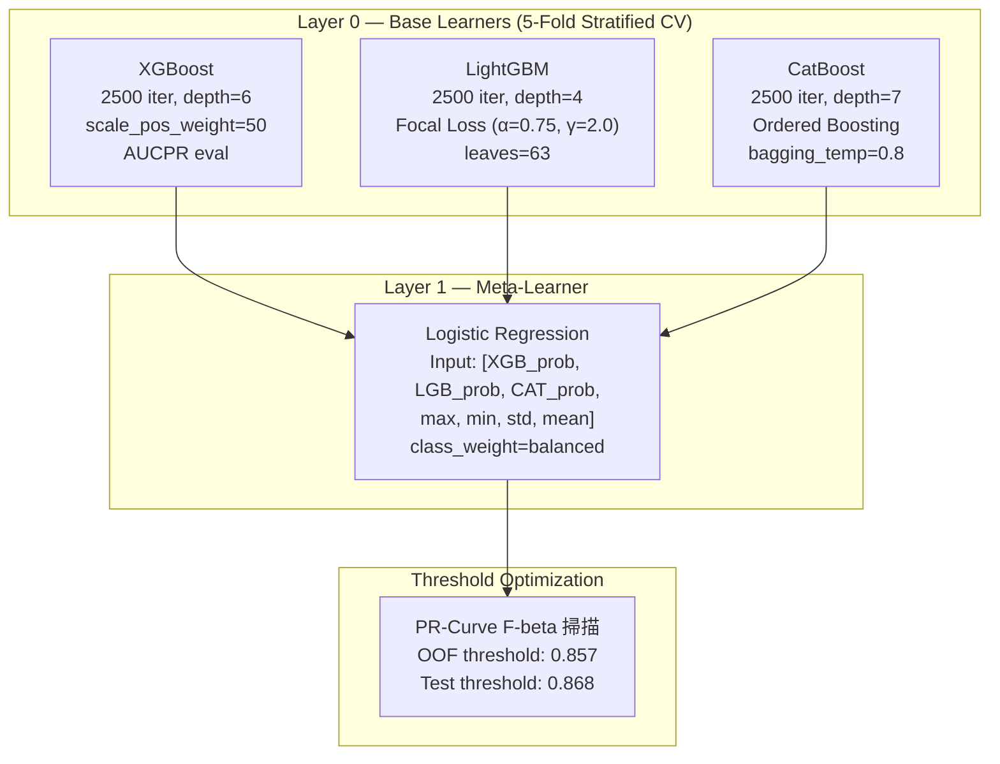

# BitoGuard：智慧合規風險雷達

> **BitoGroup × AWS 黑名單用戶偵測競賽**
>
> 針對加密貨幣交易所 77 萬筆交易紀錄，建構 GNN + Stacking Ensemble 混合模型，
> 識別人頭戶並以 SHAP 可解釋性分析提供逐案風險歸因與公平性審計。

---

## 目錄

- [專案簡介](#專案簡介)
- [系統架構](#系統架構)
- [專案結構](#專案結構)
- [資料集概覽](#資料集概覽)
- [技術棧](#技術棧)
- [完整 Pipeline](#完整-pipeline)
  - [Step 1：資料載入與驗證](#step-1資料載入與驗證)
  - [Step 2：特徵工程（81 維 → 63 維）](#step-2特徵工程81-維--63-維)
  - [Step 3：異常偵測特徵](#step-3異常偵測特徵)
  - [Step 4：圖神經網路 (GNN)](#step-4圖神經網路-gnn)
  - [Step 5：Stacking Ensemble 集成學習](#step-5stacking-ensemble-集成學習)
  - [Step 6：SHAP 可解釋性分析](#step-6shap-可解釋性分析)
  - [Step 7：公平性審計](#step-7公平性審計)
- [互動式風險儀表板](#互動式風險儀表板)
- [模型成果](#模型成果)
- [快速開始](#快速開始)
- [評分標準](#評分標準)

---

## 專案簡介

加密貨幣交易所面臨嚴重的人頭戶（黑名單用戶）問題——這些帳戶被用於洗錢、詐騙資金流轉等非法活動。傳統規則式偵測難以應對日益複雜的犯罪手法，本專案以**機器學習 + 圖神經網路**雙軌策略，從用戶行為、交易模式與鏈上資金流向三個維度，建構端到端的風險偵測系統。

**核心亮點：**

- **異質圖神經網路 (HeteroSAGE + GAT)**：捕捉用戶與錢包地址間的風險傳播路徑
- **三模型 Stacking Ensemble**：XGBoost + LightGBM (Focal Loss) + CatBoost，各自採用不同損失函數最大化模型多樣性
- **81 維特徵工程 → 63 維篩選**：涵蓋 KYC 行為、法幣/虛幣交易、IP 風險、圖拓撲、AML 紅旗指標等 11 大類特徵
- **SHAP 全方位可解釋性**：Global 重要性 + Local 歸因 + 反事實建議 + SSR 穩定性驗證 + 自然語言風險報告
- **公平性審計**：檢測性別、年齡、職業、收入四維度公平性，主動識別並建議緩解偏差
- **互動式 3D 儀表板**：React + Three.js 視覺化交易網路圖譜與風險分數

---

## 系統架構



---

## 專案結構

```mermaid
graph LR
    subgraph ROOT["Bio_AWS_Workshop/"]
        direction TB
        R1["RawData/ — 原始資料 (7 CSV)"]
        R2["adjust_data/ — 前處理後 train/test"]

        subgraph WM["Wei_model/ — 核心 ML Pipeline"]
            direction TB
            M1["model/main.py — 主訓練流程入口"]
            M2["model/Feature_rngineering.py — 特徵工程 (11 類)"]
            M3["model/feature_selection.py — 相關性 & 重要性篩選"]
            M4["model/anomaly_detection.py — IF / HBOS / LOF"]
            M5["model/Gnn_model.py — HeteroSAGE + GAT"]
            M6["model/ensemble.py — Stacking (XGB+LGB+CAT)"]
            M7["model/shap_explainer.py — SHAP + SSR + 反事實"]
            M8["model/fairness_audit.py — 四維度公平性檢測"]
            M9["model/pseudo_labeling.py — 半監督擴增"]
            M10["output/ — 模型輸出與報告"]
        end

        subgraph FD["frontend/ — React 互動式儀表板"]
            direction TB
            FD1["src/components/graph/ — 2D/3D 交易網路圖譜"]
            FD2["src/components/stats/ — 統計面板 + 風險分布"]
            FD3["src/components/fpfn/ — FP/FN 分析 + SHAP Waterfall"]
            FD4["src/components/predict/ — 預測結果檢視"]
            FD5["output/ — 前端使用的 CSV 資料"]
        end
    end
```



```
Bio_AWS_Workshop/
├── RawData/                            # 原始資料（7 張 CSV 表）
├── adjust_data/                        # 前處理後資料（train/test 切分）
│
├── Wei_model/                          # 核心 ML Pipeline
│   ├── model/
│   │   ├── main.py                    # 主訓練流程入口（12 步驟）
│   │   ├── Feature_rngineering.py     # 特徵工程（11 大類 81 維特徵）
│   │   ├── feature_selection.py       # 特徵篩選（81 → 63）
│   │   ├── anomaly_detection.py       # 無監督異常偵測（IF / HBOS / LOF）
│   │   ├── Gnn_model.py              # 異質圖神經網路（HeteroSAGE + GAT）
│   │   ├── ensemble.py               # Stacking Ensemble（XGB + LGB + CAT）
│   │   ├── shap_explainer.py         # SHAP 可解釋性 + SSR 穩定性 + 反事實
│   │   ├── fairness_audit.py         # 四維度公平性審計
│   │   └── pseudo_labeling.py        # 半監督 Pseudo-Labeling
│   ├── output/                        # 模型輸出結果
│   │   ├── metrics.json              # 效能指標
│   │   ├── fairness_summary.json     # 公平性審計報告
│   │   ├── shap_all_features.csv     # 80 特徵 SHAP 重要性排名
│   │   ├── user_risk_scores.csv      # 全部用戶風險分數
│   │   ├── risk_reports.txt          # Top 5 高風險用戶報告
│   │   ├── waterfall/               # 50+ SHAP Waterfall 圖（訓練集）
│   │   ├── waterfall_predict/       # 20+ SHAP Waterfall 圖（預測集）
│   │   └── all_user_risk_scores.xlsx # 合併 train + predict 分數
│   └── test_pipeline.py              # 消融實驗框架
│
├── frontend/                           # React 互動式儀表板
│   ├── src/
│   │   ├── components/
│   │   │   ├── layout/               # Dashboard 佈局
│   │   │   ├── stats/                # 統計面板 + 風險分布圖
│   │   │   ├── graph/                # 2D/3D 交易網路圖譜
│   │   │   ├── fpfn/                 # FP/FN 誤判分析 + SHAP Waterfall
│   │   │   └── predict/              # 預測結果檢視
│   │   ├── api/                      # API Client 模組
│   │   ├── context/                  # React Context 狀態管理
│   │   └── types/                    # TypeScript 型別定義
│   ├── output/                        # 前端讀取的 CSV 資料
│   └── dist/                          # 生產環境建置輸出
│
├── le_model/                           # 替代模型實驗
├── ARM-GraphSAGE/                      # GraphSAGE 變體實驗
└── output/                             # 各版本輸出存檔
```

---

## 資料集概覽

本專案使用 BitoGroup 提供的去識別化交易所資料，共 7 張表、**77 萬+筆交易紀錄**：

| 資料表 | 筆數 | 說明 |
|--------|------|------|
| `user_info` | 63,770 | 用戶基本資料：KYC 驗證等級、註冊時間、生日、職業、收入來源 |
| `twd_transfer` | 195,601 | 法幣（台幣）入金/提領交易紀錄 |
| `crypto_transfer` | 239,958 | 加密貨幣加值/提領/內轉，含鏈上錢包地址與協定資訊 |
| `usdt_twd_trading` | 217,634 | 掛單簿 USDT/TWD 成交訂單（含市價/限價單） |
| `usdt_swap` | 53,841 | 一鍵買賣 USDT 成交訂單 |
| `train_label` | 51,017 | 訓練標籤（0: 正常用戶 / 1: 黑名單） |
| `predict_label` | 12,753 | 預測目標（無標籤，需繳交預測結果） |

**類別不平衡**：黑名單用戶僅佔約 3.3%（328 / 10,204），屬於高度不平衡分類問題。

---

## 技術棧

| 層級 | 技術 |
|------|------|
| **機器學習** | XGBoost, CatBoost, LightGBM (Focal Loss), Scikit-learn |
| **深度學習** | PyTorch, PyTorch Geometric (Heterogeneous GNN) |
| **不平衡處理** | Borderline-SMOTE (30%), scale_pos_weight, Focal Loss |
| **特徵篩選** | 相關性篩選 (≥0.95), LightGBM 重要性篩選 |
| **異常偵測** | Isolation Forest, HBOS, LOF |
| **可解釋性** | SHAP (TreeExplainer), SSR 穩定性評估, 反事實分析 |
| **公平性** | Demographic Parity, Equalized Odds, Disparate Impact |
| **半監督** | Pseudo-Labeling（高信心樣本擴增） |
| **前端框架** | React 18 + TypeScript + Vite 5 |
| **視覺化** | react-force-graph-2d/3d, Three.js, Recharts |
| **樣式** | Tailwind CSS 3 |

---

## 完整 Pipeline



### Step 1：資料載入與驗證

從 5 張交易表 + 用戶資訊表載入資料，執行嚴格的欄位型態轉換（datetime / int / float / str），缺失值統計報告，並驗證黑名單比例一致性。

### Step 2：特徵工程（81 維 → 63 維）

自 5 張原始交易表中萃取 **81 維特徵**，分為 **11 大類別**：

| # | 特徵類別 | 數量 | 代表特徵 | 偵測意圖 |
|---|----------|------|----------|----------|
| 1 | **用戶人口特徵** | 9 | `kyc_speed_sec`, `account_age_days`, `is_app_user`, `reg_hour` | KYC 異常（秒級完成暗示自動化）、深夜註冊 |
| 2 | **法幣交易行為** | 12 | `twd_dep_sum`, `twd_net_flow`, `twd_withdraw_ratio` | 淨流出、入金/提領比異常 |
| 3 | **虛幣交易行為** | 12 | `crypto_wit_sum`, `crypto_wallet_hash_nunique`, `crypto_protocol_diversity` | 多錢包分散提領、跨鏈移轉 |
| 4 | **掛單/一鍵買賣** | 6 | `trading_buy_ratio`, `swap_sum`, `trading_market_order_ratio` | 單向購買、市價單洗量 |
| 5 | **IP & 資金流速** | 4 | `ip_unique_count`, `ip_night_ratio`, `ip_max_shared`, `fund_stay_sec` | 多 IP 切換、深夜操作、資金快進快出 |
| 6 | **交易圖拓撲** | 5 | `pagerank_score`, `connected_component_size` | 資金樞紐、詐騙集團聚集 |
| 7 | **跨表衍生** | 4 | `total_tx_count`, `weekend_tx_ratio`, `velocity_ratio_7d_vs_30d` | 近期活動加速 |
| 8 | **AML 紅旗指標** | 6 | `twd_to_crypto_out_ratio`, `same_day_in_out_count`, `tx_amount_cv` | 法幣入→幣出漏斗、Smurfing 拆單 |
| 9 | **時序模式** | 6 | `tx_interval_mean`, `tx_interval_min`, `amount_p90_p10_ratio` | 規律性操作偵測 |
| 10 | **異常偵測分數** | 3 | `if_score`, `hbos_score`, `lof_score` | 無監督異常程度 |
| 11 | **GNN 嵌入** | 16 | `gnn_emb_0` ~ `gnn_emb_15` | 圖結構風險傳播 |

**特徵篩選流程**（81 → 63 維）：
1. **零方差移除**：`has_kyc_level2`（1 個）
2. **高相關性移除**（閾值 ≥ 0.95）：`graph_out_degree`, `trading_sum`, `crypto_dep_sum` 等 13 個
3. **零重要性移除**：`twd_smurf_flag`, `betweenness_centrality` 等 4 個

### Step 3：異常偵測特徵

在 Ensemble 訓練前，先以三種無監督演算法計算每位用戶的異常分數，作為額外特徵注入模型：

| 演算法 | 輸出特徵 | 原理 |
|--------|----------|------|
| **Isolation Forest** | `if_score` | 隨機切割隔離異常點，路徑越短越異常 |
| **HBOS** | `hbos_score` | 直方圖密度估計，低密度區域為異常 |
| **LOF** | `lof_score` | 局部離群因子，偏離鄰域密度越大越異常 |

### Step 4：圖神經網路 (GNN)

利用 `crypto_transfer` 表中的鏈上錢包地址，建構**異質圖 (Heterogeneous Graph)**，捕捉傳統表格特徵無法表達的**風險傳播關係**。



- **節點類型**：`user`（用戶 ~10,204）+ `wallet`（鏈上錢包 ~16,000）
- **邊類型**：
  - `user → wallet`：虛幣提領（sends）
  - `wallet → user`：虛幣加值（receives）
  - `user → user`：站內轉帳（internal）
- **模型**：HeteroSAGE（鄰域聚合）+ GATConv（注意力機制）+ BatchNorm + MLP Head
- **訓練**：80 epochs，Binary Cross-Entropy with `pos_weight`
- **輸出**：64-dim 嵌入 → PCA 降至 16 維（保留 92% 方差），注入 Ensemble 作為特徵

### Step 5：Stacking Ensemble 集成學習

採用兩層 Stacking 架構，三個 Base Learner **各自使用不同損失函數**以最大化模型多樣性：



**不平衡處理策略**：
- **Focal Loss**（LightGBM）：α=0.75, γ=2.0，自動增加邊界樣本的損失權重
- **scale_pos_weight=50**（XGBoost / CatBoost）：正負比例加權
- **Borderline-SMOTE**（可選）：僅對邊界少數類過採樣 30%

### Step 6：SHAP 可解釋性分析

使用 SHAP TreeExplainer 對 XGBoost 模型進行全方位解釋：

**Global 解釋** — Top 10 特徵重要性：

| 排名 | 特徵 | 中文 | SHAP 佔比 | 累積 |
|------|------|------|-----------|------|
| 1 | `swap_sum` | 一鍵買賣總額 | 5.83% | 5.83% |
| 2 | `tx_interval_median` | 交易間隔中位數 | 5.83% | 11.65% |
| 3 | `account_age_days` | 帳號年齡 | 5.67% | 17.32% |
| 4 | `crypto_wit_sum` | 虛幣提領總額 | 5.00% | 22.32% |
| 5 | `weekend_tx_ratio` | 週末交易佔比 | 3.48% | 25.80% |
| 6 | `career_freq` | 職業頻率 | 3.36% | 29.17% |
| 7 | `ip_night_ratio` | 深夜操作比例 | 3.10% | 32.27% |
| 8 | `twd_net_flow` | 法幣淨流入金額 | 3.09% | 35.36% |
| 9 | `tx_interval_mean` | 交易間隔均值 | 2.61% | 37.96% |
| 10 | `reg_hour` | 註冊時段 | 2.43% | 40.40% |

> GNN 嵌入特徵（`gnn_emb_*`）合計貢獻約 **12.8%**，驗證圖結構資訊的有效性。
> 異常偵測分數（`if_score`, `lof_score`, `hbos_score`）合計貢獻約 **3.0%**。

**Local 解釋**（個案分析）：
- 每位用戶的 SHAP Waterfall Plot：base value → 各特徵推/拉 → 最終預測
- 訓練集產出 50+ 張、預測集產出 20+ 張 Waterfall 圖

**反事實分析（Counterfactual）**：
- 自動建議哪些特徵調整可降低風險
- 範例：「若將 KYC 完成速度從 54,799 秒調整至 0，風險分數可降低 0.014」

**SSR 穩定性驗證**：
- 以 ε = 0.05 ~ 0.20 擾動特徵值，驗證 SHAP 排名在擾動下的一致性
- 確保解釋結果對微小資料變動具有穩健性

### Step 7：公平性審計

對四個受保護屬性進行全面公平性檢測：

| 受保護屬性 | 檢測結果 | DPD | TPR Gap | FPR Gap | DIR |
|-----------|---------|-----|---------|---------|-----|
| **性別 (Gender)** | **FAIL** | 0.067 ⚠️ | 0.225 ❌ | 0.042 ✅ | 0.261 ❌ |
| **年齡 (Age)** | **FAIL** | 0.064 ⚠️ | 0.153 ❌ | 0.053 ⚠️ | 0.230 ❌ |
| **職業風險 (Career)** | **PASS** | 0.006 ✅ | 0.024 ✅ | 0.005 ✅ | 0.870 ✅ |
| **收入來源 (Income)** | **FAIL** | 0.020 ✅ | 0.084 ⚠️ | 0.016 ✅ | 0.522 ❌ |

> **指標說明**：DPD = Demographic Parity Diff, TPR Gap = True Positive Rate 差距, DIR = Disparate Impact Ratio (0.8~1.25 為公平)

**關鍵發現**：
- 女性用戶 TPR 51.4% vs 男性 28.9%（女性被標記率為男性 1.77 倍）
- 30-50 歲群組 TPR 46.6% 顯著高於其他年齡段

**建議緩解措施**：
- 移除 `is_female` + `age` 特徵（無反洗錢業務正當性）
- 保留 `is_high_risk_career` + `is_high_risk_income`（有法規依據，且通過公平性檢測）

---

## 互動式風險儀表板

使用 React + TypeScript + Vite 建構，支援三種檢視模式：

### Fraud Mode（預設）
- **左側面板**：統計 KPI（總節點數、詐騙比例、風險分布）+ 高風險用戶清單
- **右側主區**：2D / 3D 力導向圖（Force-Directed Graph），視覺化用戶與錢包的交易網路
- **節點詳情**：點選節點查看用戶資訊 + Top SHAP 因子

### FP/FN Mode（誤判分析）
- 分析 False Positive（誤報）與 False Negative（漏報）案例
- 每個案例附帶 SHAP Waterfall 圖，解釋模型為何判斷錯誤

### Predict Mode（預測結果）
- 展示 12,753 筆未標記用戶的預測風險分數
- 每位用戶顯示 Top SHAP 特徵貢獻

**技術實現**：
- **狀態管理**：React Context API (DashboardContext)
- **圖譜渲染**：react-force-graph-2d/3d + Three.js
- **圖表**：Recharts（風險分數直方圖、關係統計）
- **資料流**：前端直接讀取 `frontend/output/*.csv`，經 Vite 中間件提供 CSV 服務

---

## 模型成果

### 效能指標

| 指標 | 數值 | 說明 |
|------|------|------|
| **AUC-ROC** | 0.858 | 整體判別能力優秀 |
| **AUC-PR** | 0.308 | 在高度不平衡下的精確率-召回率表現 |
| **F1-Score** | 0.361 | 精確率與召回率的調和平均 |
| **Precision** | 0.321 | 預測為黑名單中，真正是黑名單的比例 |
| **Recall** | 0.412 | 實際黑名單中，被成功偵測的比例 |
| **OOF Threshold** | 0.857 | Out-of-Fold 最佳閾值 |
| **Test Threshold** | 0.868 | 測試集 PR-Curve 最佳 F1 閾值 |

### 風險報告範例

```
╔══════════════════════════════════════════╗
  用戶風險報告  |  User ID: 928967
╚══════════════════════════════════════════╝

  風險分數   : 0.9874
  風險等級   : 極高風險
  建議行動   : 建議立即凍結帳戶並啟動人工調查

  ── 主要風險因子（SHAP）──
  1. 一鍵買賣總額         =  0.950  ▲ 0.7949
  2. 交易間隔最小值        =  0.081  ▲ 0.3702
  3. 交易間隔中位數        = -0.017  ▲ 0.3115
  4. 法幣提領最大值        =  0.943  ▲ 0.2901
  5. 帳號年齡（天）        = -0.745  ▲ 0.2023

  ── 可改善建議（反事實）──
  • 若將「KYC 完成速度」從 3,031 秒調整至 0，風險分數可降低 0.015
  • 若將「法幣提領比率」從 10.0 調整至 0，風險分數可降低 0.012
```

### 產出檔案一覽

| 檔案 | 說明 |
|------|------|
| `metrics.json` | 模型效能指標 (AUC-ROC / AUC-PR / F1 / Precision / Recall) |
| `user_risk_scores.csv` | 10,204 位用戶風險分數 + 風險等級 |
| `all_user_risk_scores.xlsx` | 合併 train + predict 全量分數 |
| `shap_all_features.csv` | 80 特徵 SHAP 重要性排名（含累積百分比） |
| `shap_values_all_top10.csv` | 每位用戶 Top 10 SHAP 值 |
| `risk_reports.txt` | Top 5 高風險用戶自然語言報告 |
| `fairness_summary.json` | 四維度公平性審計完整報告 |
| `fairness_report.csv` | 公平性指標量化數據 |
| `feature_selection_report.json` | 特徵篩選過程記錄 |
| `waterfall/*.png` | 50+ 張 SHAP Waterfall 圖（訓練集） |
| `waterfall_predict/*.png` | 20+ 張 SHAP Waterfall 圖（預測集） |
| `gnn_model.pt` | 訓練好的 GNN 模型權重 |

---

## 快速開始

### 環境需求

- Python 3.9+
- Node.js 18+
- CUDA（選用，加速 GNN 訓練）

### 模型訓練

```bash
# 安裝 Python 依賴
pip install xgboost catboost lightgbm scikit-learn shap torch torch_geometric imbalanced-learn pyod

# 執行完整 Pipeline（12 步驟全自動）
cd Wei_model/model
python main.py --data_dir ../../adjust_data/train --output ../output

# 跳過 GNN（無 GPU 時）
python main.py --data_dir ../../adjust_data/train --output ../output --skip_gnn
```

### 前端儀表板

```bash
cd frontend

# 安裝依賴
npm install

# 開發模式（http://localhost:5173）
npm run dev

# 生產環境建置
npm run build
```

---

## 評分標準

| 權重 | 項目 | 本專案對應 |
|------|------|-----------|
| 40% | 模型辨識效能（F1-score） | Stacking Ensemble + GNN + Anomaly，AUC-ROC 0.858，F1 0.361 |
| 30% | 風險說明能力（SHAP 可解釋性） | Global/Local SHAP + 反事實 + SSR 穩定性 + 自然語言報告 |
| 15% | 完整性與實務可用性 | 端到端 12 步 Pipeline + 公平性審計 + 半監督擴增 |
| 10% | 主題切合及創意度 | 異質圖風險傳播 + AML 紅旗特徵 + 無監督異常偵測融合 |
| 5%  | 加分項（視覺化、AWS） | React 2D/3D 交易網路圖譜 + FP/FN 互動分析儀表板 |
