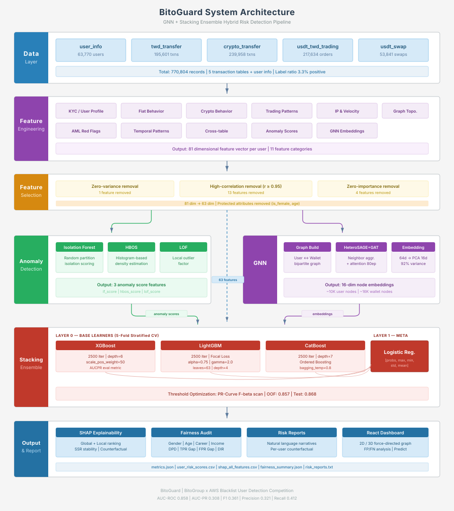
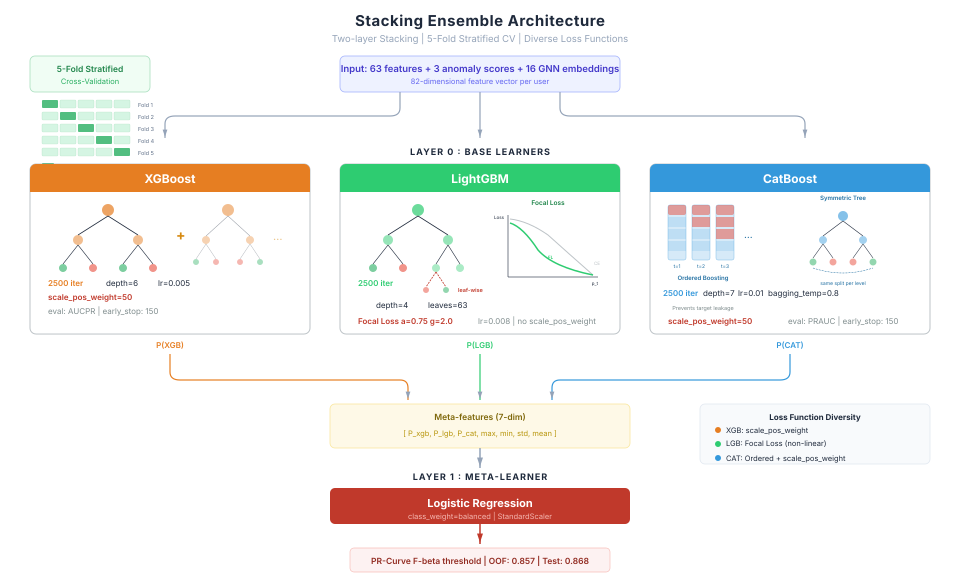

<h1 align="center">BitoGuard：智慧合規風險雷達</h1>

<p align="center">
  <strong>AI 驅動的加密貨幣黑名單偵測系統 — LOO 毒性特徵 + Stacking 集成（F1 = 0.8277）</strong>
</p>

<p align="center">
  <a href="https://ws97109.github.io/Bio_AWS_Workshop/"></a>
  <a href="https://opensource.org/licenses/MIT"></a>
  <a href="https://www.python.org/downloads/"></a>
  <a href="https://xgboost.ai/"></a>
  <a href="https://reactjs.org/"></a>
  <a href="https://www.typescriptlang.org/"></a>
  
</p>

<p align="center">
  <a href="README_ZH.md">中文</a> | <a href="README.md">English</a>
</p>

---

## Demo

<p align="center">
  
</p>

> 互動式 3D 風險儀表板 — 即時視覺化交易網路圖譜、節點風險分數與 SHAP 可解釋性分析

---

## Overview

<table>
<tr>
<td width="60%">

加密貨幣交易所面臨嚴重的**人頭戶（黑名單用戶）**問題——這些帳戶被用於洗錢、詐騙資金流轉等非法活動。

本專案針對 **77 萬筆交易紀錄**建構端到端風險偵測系統。經過完整實驗流程（詳見 [`final_model/docs/`](final_model/docs/)），最終架構由 **LOO（Leave-One-Out）毒性特徵**主導——這是移植自[第一名 BitoGuard 團隊](https://github.com/gttthuang/Bito)的圖訊號→表格特徵轉換方法，將 F1 從 0.37 直接推到 0.83。

- **LOO 毒性特徵（14 維）**：對每位使用者，計算其共用錢包 / 共用 IP / 直接轉帳對象上的黑名單密度，以留一法扣除自身標籤防止目標洩漏
- **三模型 Stacking 集成**：XGBoost + LightGBM (Focal Loss α=0.75, γ=2.0) + CatBoost，Logistic Regression meta-learner
- **非監督異常分數**：Isolation Forest + HBOS + LOF 作為補充特徵
- **SHAP 全方位可解釋性**：逐案風險歸因 + 反事實建議 + SSR 穩定性檢測
- **公平性審計**：性別、年齡、職業、收入四維度偏差檢測

</td>
<td width="40%">



</td>
</tr>
</table>

---

## 競賽與活動

本專案為 [**去偽存真：全民偵查黑客松 (Agent for Truth: Disinformation Defense Hackathon)**](https://www.ai-expo.tw/kiro_hackathon_2026/) 的參賽作品，選擇**幣託科技 (BitoPro) — 虛擬貨幣交易安全**賽題。

| 項目 | 說明 |
|------|------|
| **競賽名稱** | 去偽存真：全民偵查黑客松 (Agent for Truth) |
| **主辦單位** | DIGITIMES × 國發會 × AWS |
| **合作企業** | 幣託科技 (BitoPro)、Gogolook |
| **競賽日期** | 2026 年 3 月 26–27 日 |
| **競賽地點** | AWS 南山辦公室 / 圓山花博爭豔館（Taiwan AI EXPO 2026） |
| **賽題** | 虛擬貨幣交易安全 — 偵測人頭戶與詐騙交易 |

<table>
<tr>
<td width="50%">
<p align="center">
  
</p>
<p align="center"><sub><b>Taiwan AI EXPO 2026</b> — 團隊於會場展示 BitoGuard 系統</sub></p>
</td>
<td width="50%">
<p align="center">
  
</p>
<p align="center"><sub><b>去偽存真黑客松</b> — 競賽活動現場（花博爭豔館未來舞台）</sub></p>
</td>
</tr>
</table>

---

## Key Features

| | | | |
|:---:|:---:|:---:|:---:|
| **LOO 毒性特徵（14 維）** | **特徵工程（81 維）** | **三模型 Stacking** | **SHAP 可解釋性** |
| 錢包 / IP / 鄰居毒性 | 11 大類，77 維篩選 | XGB + LGB(Focal) + Cat | Global + Local + 反事實 |

| | | | |
|:---:|:---:|:---:|:---:|
| **公平性審計** | **互動式儀表板** | **異常偵測** | **多閾值提交** |
| 四維度偏差檢測 | React + D3 關聯圖 | IF / HBOS / LOF | max_f1 / max_f2 / min_cost |

---

## Performance

LOO 毒性特徵突破後的測試集指標（10,204 筆資料、328 正例，5-fold CV 穩定）：

<table>
<tr>
<td width="25%" align="center">
<h3>0.9778</h3>
<sub>AUC-ROC</sub>
</td>
<td width="25%" align="center">
<h3>0.8600</h3>
<sub>AUC-PR</sub>
</td>
<td width="25%" align="center">
<h3>0.7470</h3>
<sub>Recall</sub>
</td>
<td width="25%" align="center">
<h3>0.8277</h3>
<sub>F1-Score</sub>
</td>
</tr>
</table>

<details>
<summary><b>Baseline vs. LOO — 突破關鍵</b></summary>

| 指標 | Baseline（加入 LOO 之前）| 加入 LOO 之後 | 變化 |
|------|---|---|---|
| **F1** | 0.3746 | **0.8277** | **+121%** |
| **AUC-PR** | 0.3262 | **0.8600** | +164% |
| **AUC-ROC** | 0.8641 | **0.9778** | +13% |
| **Precision** | 0.3552 | **0.9280** | +161% |
| **Recall** | 0.3963 | **0.7470** | +88% |

完整實驗紀錄：[`final_model/docs/LOO_TOXICITY_REPORT.md`](final_model/docs/LOO_TOXICITY_REPORT.md)

</details>

---

## System Architecture

<p align="center">
  
</p>

---

## 完整 Pipeline

### Step 1：資料載入與驗證

從 5 張交易表 + 用戶資訊表載入資料，執行嚴格的欄位型態轉換，缺失值統計報告，並驗證黑名單比例一致性。

### Step 2：特徵工程（95 → 77 → 78 維）

自 5 張原始交易表中萃取 **95 維特徵**，分為 **11 大類別**。其中 81 維為行為特徵，最後 14 維為 **LOO 毒性特徵**——移植自第一名 BitoGuard 的突破性方法。

| # | 特徵類別 | 數量 | 代表特徵 | 偵測意圖 |
|---|----------|------|----------|----------|
| 1 | **用戶人口特徵** | 15 | `kyc_speed_sec`, `account_age_days`, `reg_hour` | KYC 異常、深夜註冊 |
| 2 | **法幣交易行為** | 14 | `twd_dep_sum`, `twd_net_flow`, `twd_smurf_flag` | 淨流出、Smurfing |
| 3 | **虛幣交易行為** | 15 | `crypto_wit_sum`, `crypto_wallet_hash_nunique` | 多錢包分散提領 |
| 4 | **掛單/一鍵買賣** | 9 | `trading_buy_ratio`, `swap_sum` | 單向購買、市價單洗量 |
| 5 | **IP & 資金流速** | 5 | `ip_unique_count`, `ip_night_ratio`, `fund_stay_sec` | 多 IP 切換、快進快出 |
| 6 | **交易圖拓撲** | 5 | `pagerank_score`, `connected_component_size` | 資金樞紐、集團聚集 |
| 7 | **跨表衍生** | 4 | `total_tx_count`, `weekend_tx_ratio` | 近期活動加速 |
| 8 | **AML 紅旗指標** | 6 | `twd_to_crypto_out_ratio`, `same_day_in_out_count` | 法幣入→幣出漏斗 |
| 9 | **時序模式** | 7 | `tx_interval_mean`, `amount_p90_p10_ratio` | 規律性操作、爆發交易 |
| 10 | **複合風險分數** | 1 | `composite_risk_score` | 多維度加權綜合 |
| 11 | **LOO 毒性特徵** ⭐ | **14** | `w_tox_{max,mean,std}`、`toxic_w_{ratio,count}`、`ip_tox_{mean,max}`、`toxic_ip_count`、`relation_blacklist_{ratio,count}`、`neighbor_tox_{mean,max}`、`toxic_neighbor_count`、`n_neighbors` | **共用錢包 / IP / 轉帳對象黑名單密度，含 Leave-One-Out 洩漏防護** |

<details>
<summary><b>LOO 毒性特徵 — 突破關鍵</b></summary>

對每個 `(使用者 i, 共用錢包 w)` 組合：

```
tox(w, i) = (bl_count_w − is_bl_i + S × global_rate) / (total_count_w − 1 + S)
S = 50    （低樣本錢包的平滑常數）
```

分子的 `− is_bl_i` 與分母的 `− 1` 就是 **Leave-One-Out** 修正——**使用者自己的標籤永遠不會進入自己的毒性分數計算**，完全防止目標洩漏。

**為何有效**：傳統特徵描述「這個使用者在做什麼」（行為）。LOO 毒性描述「這個使用者跟誰來往」（關聯）。AML 本質是共犯犯罪——人頭戶會集中在同樣的錢包、IP、轉帳對象。這個 domain 知識**直接編碼成公式**，不用靠 GNN 去學。

**類別區別力**（mean 值，黑名單 vs. 正常）：
- `toxic_ip_count`：0.002 vs **0.099**（55 倍差距）
- `toxic_w_count`：0.34 vs **0.96**（2.8 倍差距）
- `relation_blacklist_count`：0.003 vs **0.023**（9 倍差距）

致謝：[gttthuang/Bito](https://github.com/gttthuang/Bito) — 忠實移植自其 `build_toxicity_features` 函式。

</details>

<details>
<summary><b>特徵篩選流程（95 → 78）</b></summary>

1. **零方差移除**：1 個（`has_kyc_level2`）
2. **高相關性移除**（閾值 ≥ 0.95）：14 個高度共線性特徵
3. **零重要性移除**（LightGBM）：3 個
4. 篩選後：**77 維**
5. 公平性審計移除受保護屬性：`is_female`、`age`（−2）→ **75 維**
6. 加入異常偵測分數：IF + HBOS + LOF（+3）→ **最終 78 維**

</details>

### Step 3：異常偵測特徵

| 演算法 | 輸出特徵 | 原理 |
|--------|----------|------|
| **Isolation Forest** | `if_score` | 隨機切割隔離異常點，路徑越短越異常 |
| **HBOS** | `hbos_score` | 直方圖密度估計，低密度區域為異常 |
| **LOF** | `lof_score` | 局部離群因子，偏離鄰域密度越大越異常 |

### Step 4：Stacking Ensemble 集成學習

採用兩層 Stacking 架構，三個 Base Learner **各自使用不同損失函數**以最大化模型多樣性：

<p align="center">
  
</p>

<details>
<summary><b>不平衡處理策略</b></summary>

- **Focal Loss**（LightGBM）：α=0.75, γ=2.0，自動增加邊界樣本的損失權重
- **scale_pos_weight=50**（XGBoost / CatBoost）：正負比例加權
- **Borderline-SMOTE**（可選）：僅對邊界少數類過採樣 30%

</details>

### Step 5：SHAP 可解釋性分析

**Global 解釋** — Top 10 特徵重要性（加入 LOO 後）：

| 排名 | 特徵 | 中文 | SHAP 佔比 | 累積 |
|------|------|------|-----------|------|
| 1 | **`w_tox_max`** 🟢 | **錢包毒性（最高）** | **25.4%** | 25.4% |
| 2 | **`w_tox_mean`** 🟢 | **錢包毒性（平均）** | **9.2%** | 34.5% |
| 3 | **`neighbor_tox_mean`** 🟢 | **二階鄰居毒性（平均）** | **8.5%** | 43.1% |
| 4 | `tx_interval_median` | 交易間隔中位數 | 3.0% | 46.1% |
| 5 | `twd_net_flow` | 法幣淨流入金額 | 2.9% | 48.9% |
| 6 | `weekend_tx_ratio` | 週末交易佔比 | 2.7% | 51.7% |
| 7 | `if_score` | Isolation Forest 分數 | 2.4% | 54.1% |
| 8 | `career_freq` | 職業頻率 | 2.3% | 56.4% |
| 9 | `account_age_days` | 帳號年齡 | 2.2% | 58.6% |
| 10 | `swap_sum` | 一鍵買賣總額 | 2.1% | 60.8% |

> **LOO 特徵合計貢獻約 48%** — 光是 Top 3（全部是 LOO）就佔 43%。這實證了「**關聯力大於行為力**」的 AML 偵測假設。

<details>
<summary><b>Local 解釋 + 反事實分析 + SSR 穩定性</b></summary>

**Local 解釋**：每位用戶的 SHAP Waterfall Plot — base value → 各特徵推/拉 → 最終預測

**反事實分析（Counterfactual）**：自動建議哪些特徵調整可降低風險
- 範例：「若將 KYC 完成速度從 54,799 秒調整至 0，風險分數可降低 0.014」

**SSR 穩定性驗證**：以 ε = 0.05 ~ 0.20 擾動特徵值，驗證 SHAP 排名的穩健性

</details>

### Step 7：公平性審計

| 受保護屬性 | 檢測結果 | DPD | TPR Gap | FPR Gap | DIR |
|-----------|---------|-----|---------|---------|-----|
| **性別 (Gender)** | **FAIL** | 0.039 | 0.041 | 0.003 | 0.285 |
| **年齡 (Age)** | **FAIL** | 0.030 | 0.062 | 0.003 | 0.343 |
| **職業風險 (Career)** | **FAIL** | 0.009 | 0.122 | 0.001 | 0.729 |
| **收入來源 (Income)** | **FAIL** | 0.012 | 0.238 | 0.001 | 0.557 |

<details>
<summary><b>關鍵發現與建議</b></summary>

新模型 Precision 0.928 極高，所有分組的絕對 FPR 都降到 <0.5%，**FPR Gap 全部通過**。但 Disparate Impact Ratio（min/max 正例率）全部失敗——因為模型選得太嚴格，稀有分類在小群組上的「被選中比例」容易放大成大的比率差距。

- `is_female` 與 `age` 已從訓練特徵中**排除**（受保護屬性）
- `is_high_risk_career` 與 `is_high_risk_income` 保留（AML 法規依據）
- DIR 失敗偏資訊性而非可操作的 bug——模型本身運作正確（極度選擇性），但在小子群上選擇率自然拉開

完整審計資料：[`final_model/output/baseline_loo/fairness_summary.json`](final_model/output/baseline_loo/fairness_summary.json)

</details>

---

## 互動式風險儀表板

使用 React + TypeScript + Vite 建構，支援三種檢視模式：

| 模式 | 功能 |
|------|------|
| **Fraud Mode** | 2D/3D 力導向交易網路圖譜、統計 KPI、高風險用戶清單、節點 SHAP 分析 |
| **FP/FN Mode** | 誤判案例分析 + SHAP Waterfall 圖，解釋模型判斷錯誤原因 |
| **Predict Mode** | 12,753 筆未標記用戶的預測風險分數 + Top SHAP 特徵貢獻 |

---

## 風險報告範例

```
╔══════════════════════════════════════════╗
  用戶風險報告  |  User ID: 928967
╚══════════════════════════════════════════╝

  風險分數   : 0.9874
  風險等級   : 極高風險
  建議行動   : 建議立即凍結帳戶並啟動人工調查

  ── 主要風險因子（SHAP）──
  1. 一鍵買賣總額         =  0.950  ▲ 0.7949
  2. 交易間隔最小值        =  0.081  ▲ 0.3702
  3. 交易間隔中位數        = -0.017  ▲ 0.3115
  4. 法幣提領最大值        =  0.943  ▲ 0.2901
  5. 帳號年齡（天）        = -0.745  ▲ 0.2023

  ── 可改善建議（反事實）──
  • 若將「KYC 完成速度」從 3,031 秒調整至 0，風險分數可降低 0.015
  • 若將「法幣提領比率」從 10.0 調整至 0，風險分數可降低 0.012
```

---

## 技術棧

| 層級 | 技術 |
|------|------|
| **機器學習** | XGBoost, CatBoost, LightGBM (Focal Loss), Scikit-learn |
| **圖特徵** | LOO 毒性（向量化 Pandas）— 可選：PyTorch Geometric HeteroGNN |
| **不平衡處理** | Focal Loss, scale_pos_weight, F-beta / 成本敏感閾值 |
| **異常偵測** | Isolation Forest, HBOS, LOF |
| **可解釋性** | SHAP (TreeExplainer), SSR 穩定性, 反事實分析 |
| **公平性** | Demographic Parity, Equalized Odds, Disparate Impact |
| **前端框架** | React 18 + TypeScript + Vite 5 |
| **視覺化** | react-force-graph-2d/3d, Three.js, Recharts |
| **樣式** | Tailwind CSS 3 |

---

## Quick Start

### 模型訓練

```bash
# 安裝 Python 依賴
pip install xgboost catboost lightgbm scikit-learn shap torch torch_geometric imbalanced-learn pyod

# 執行完整 Pipeline（12 步驟全自動）
cd final_model/model
python main.py --data_dir ../../adjust_data/train --output ../output

# 跳過 GNN — 推薦（消融實驗顯示加 GNN 反而讓 F1 略降）
python main.py --data_dir ../../adjust_data/train --output ../output --skip_gnn

# 後處理：產生多閾值提交（max_f1 / max_f2 / min_cost）
python run_final_from_predictions.py \
    --baseline_dir ../output \
    --output_dir ../output/final

# 重建前端需要的關聯圖 CSV（不需訓練 GNN）
python build_graph_export.py \
    --data_dir ../../adjust_data/train \
    --predict_dir ../../adjust_data/predict \
    --risk_scores ../output/all_user_risk_scores.csv \
    --output_dir ../output
```

### 前端儀表板

```bash
cd frontend
npm install
npm run dev        # 開發模式（http://localhost:5173）
npm run build      # 生產環境建置
```

---

## 專案結構

<details>
<summary><b>展開完整目錄</b></summary>

```
Bio_AWS_Workshop/
├── final_model/                          # 核心 ML Pipeline
│   ├── model/
│   │   ├── main.py                    # 主訓練流程入口（12 步驟）
│   │   ├── Feature_engineering.py     # 特徵工程（11 大類 95 維，含 LOO）
│   │   ├── feature_selection.py       # 特徵篩選（95 → 77）
│   │   ├── anomaly_detection.py       # 無監督異常偵測（IF / HBOS / LOF）
│   │   ├── Gnn_model.py              # 異質圖神經網路（可選——消融顯示無幫助）
│   │   ├── ensemble.py               # Stacking Ensemble（XGB + LGB-Focal + Cat）
│   │   ├── shap_explainer.py         # SHAP 可解釋性 + SSR + 反事實
│   │   ├── fairness_audit.py         # 四維度公平性審計
│   │   ├── improved_evaluation.py    # F-beta / 成本敏感閾值策略
│   │   ├── pu_learning.py            # PU learning base learner（實測——邊際）
│   │   ├── tabpfn_base.py            # TabPFN foundation model（需 license）
│   │   ├── run_final_from_predictions.py  # 多閾值提交產生器
│   │   ├── build_graph_export.py     # 前端用關聯圖 CSV（無需 GNN）
│   │   ├── build_frontend_data.py    # 前端用 SHAP / 風險 CSV
│   │   └── pseudo_labeling.py        # 半監督 Pseudo-Labeling（實測——邊際）
│   ├── docs/
│   │   ├── LOO_TOXICITY_REPORT.md    # LOO 突破完整報告
│   │   ├── model_improvements_2026-04.md  # 完整實驗紀錄
│   │   └── CHANGELOG_2026-04-21.md
│   └── output/                        # 模型輸出結果
│
├── Yu_model/                          # 資金追溯模型
│   └── trace_back_model/             # 詐騙資金鏈追蹤
│
├── frontend/                           # React 互動式儀表板
│   ├── src/
│   │   ├── components/               # UI 元件
│   │   ├── utils/                    # 資料處理與圖譜邏輯
│   │   └── types/                    # TypeScript 型別
│   └── output/                        # 前端讀取的 CSV 資料
│
├── assets/                            # 架構圖與媒體素材
└── docs/                              # 文件
```

</details>

---

## 致謝

LOO 毒性特徵族群（第 2 節 / Step 2）是忠實移植自同場競賽**第一名 BitoGuard 團隊**的 repo（[gttthuang](https://github.com/gttthuang/Bito)）。他們的洞見——**共用錢包 / IP 黑名單密度編碼為表格特徵在這個資料量級勝過 GNN**——是本專案把 F1 從 0.37 推到 0.83 的唯一最大貢獻者。特此致謝。


---

## License

This project is licensed under the MIT License - see [LICENSE](LICENSE) for details.

---

<p align="center">
  <a href="https://github.com/ws97109/Bio_AWS_Workshop">
    
  </a>
  <a href="https://github.com/ws97109/Bio_AWS_Workshop/fork">
    
  </a>
</p>

<p align="center">
  <sub>BitoGuard — AI-Powered AML Risk Detection for Cryptocurrency Exchanges</sub>
</p>
